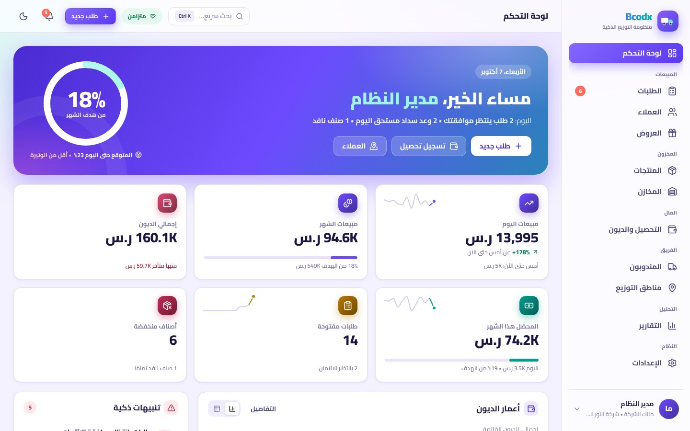
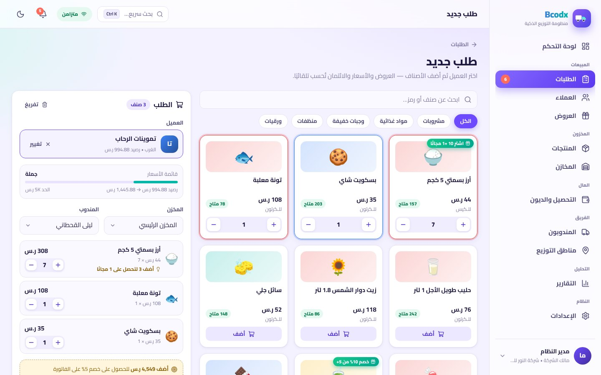
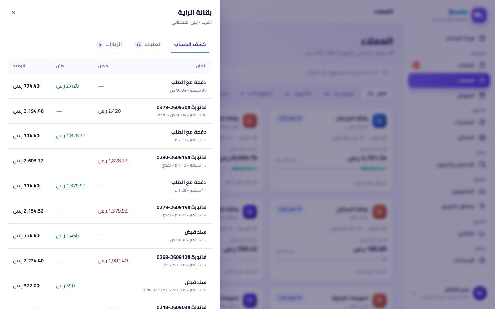
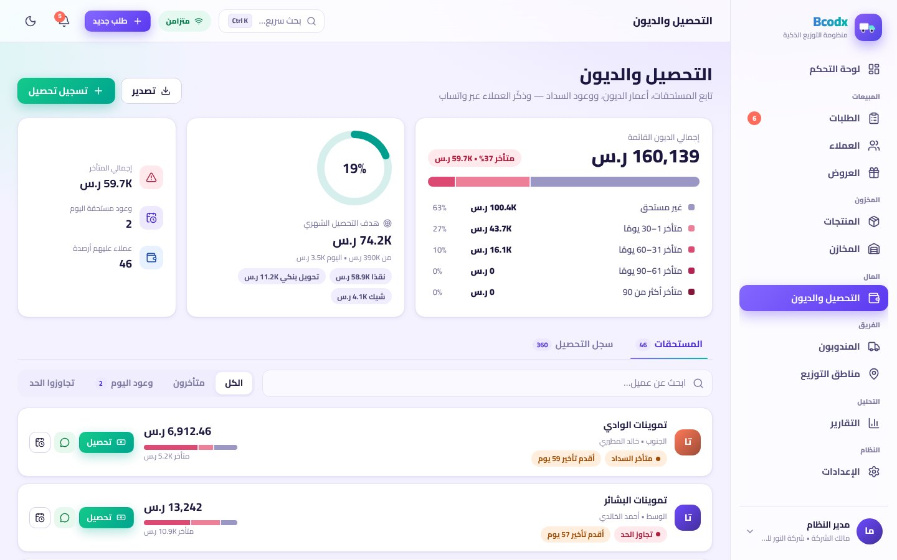
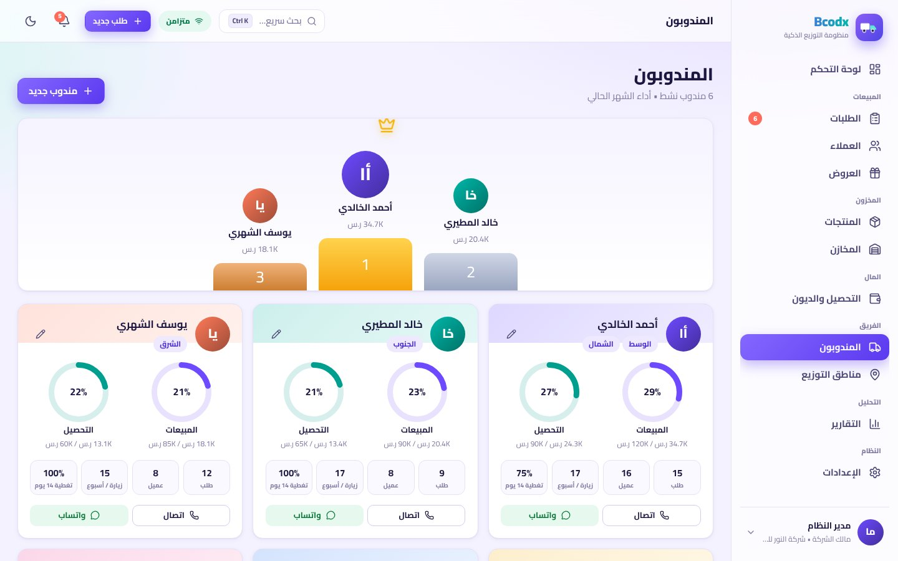

<div dir="rtl" align="right">


# Bhub — منظومة إدارة الموزعين الذكية

> من **واتساب ← اتصال ← إكسل ← دفتر ← اتصال بالمخزن ← فاتورة**
> إلى **منظومة واحدة حيّة**: العملاء ← الطلبات ← المنتجات ← المخزون ← التحصيل ← التقارير.

تطبيق ويب (PWA) عربي RTL بواجهة متحركة، مبني على **React + TypeScript + Firebase (Auth + Firestore)**، لشركات التوزيع التي لديها موزعون ومندوبو مبيعات ومخازن وطلبيات وديون وتحصيل ومنتجات وعروض ومناطق توزيع.



| طلب جديد (عروض وائتمان تلقائيان) | كشف حساب العميل |
|---|---|
|  |  |

| التحصيل وأعمار الديون | المندوبون |
|---|---|
|  |  |

لقطات إضافية: [الدخول](docs/screenshots/01-login.jpg) · [العروض](docs/screenshots/07-offers.jpg) · [الوضع الداكن](docs/screenshots/08-dashboard-dark.jpg) · [الجوال](docs/screenshots/09-mobile-dashboard.jpg)

---

## ما الذي تحصل عليه الشركة

```
Dashboard
│
├── المبيعات       مبيعات اليوم/الشهر، هدف الشهر والوتيرة المتوقعة، مقارنة بأمس حتى الساعة نفسها
├── المندوبون      لوحة ترتيب، أهداف مبيعات وتحصيل، زيارات وتغطية، اتصال/واتساب
├── العملاء        بطاقات صحة ائتمانية، كشف حساب بالرصيد الجاري، زيارات، وعود سداد
├── المخازن        مخازن رئيسية/فرعية/سيارات، استلام وتحويل وجرد، سجل حركات
├── الديون         أعمار الديون (غير مستحق / 1–30 / 31–60 / 61–90 / +90)
├── المناطق        خريطة فقاعات للمبيعات، تغطية الزيارات، ديون كل منطقة
├── الطلبات        مسار: جديد ← معتمد ← قيد التجهيز ← مسلَّم (+ موافقة الائتمان)
├── التحصيل        سندات قبض، نقد/تحويل/شيك، وعود بالسداد، هدف تحصيل
└── التقارير       مبيعات، منتجات وربحية، مندوبون، مناطق، ديون، تحصيل، مخزون (CSV + طباعة)
```

### ما يميّزه (مبني على تحليل ثغرات المنافسين — [التفاصيل](docs/COMPETITIVE_ANALYSIS.md))

| الثغرة عند المنافسين | ما في Bhub |
|---|---|
| أنظمة مؤسسية بتسعير غامض وتطبيق طويل | تجربة فورية بلا حساب، وإعداد شركة في دقيقة، وFirebase بلا خوادم تُدار |
| التحصيل والائتمان ضعيفان | **أعمار ديون دقيقة** + حدود ائتمان + **تجميد الطلب لموافقة المدير** + وعود سداد + أهداف تحصيل |
| واتساب يُركَّب فوق النظام | كشف حساب، تذكير سداد، إيصال، وفاتورة **بضغطة واحدة** |
| مزامنة متأخرة وضعف دون إنترنت | تخزين محلي دائم (Firestore) + PWA + مؤشر مزامنة + أرقام طلبات لا تحتاج عدّادًا مركزيًا |
| واجهة ثقيلة/ضعيفة وتستهلك البطارية | رسوم SVG خفيفة بلا مكتبات رسم، تقسيم الحزم، احترام «تقليل الحركة» |
| دعم عربي ضعيف | RTL كامل، أرقام لاتينية واضحة، تواريخ عربية، وضع داكن |
| لوحات بيانات ثقيلة وصعبة القراءة | رسوم مُدقَّقة بمعايير dataviz (ألوان آمنة لعمى الألوان، جدول بديل لكل رسم، عزل السلاسل، تلميح بلوحة المفاتيح) ولوحة أوامر `Ctrl+K` — [نظام التصميم](docs/DESIGN.md) |
| مساءلة الميدان | زيارات مع الموقع، تغطية 14 يومًا، تنبيه «عملاء لم تتم زيارتهم» |
| CRM غير مرتبط بالمخزون والأسعار | الطلب يحجز المخزون ويسعّر حسب قائمة العميل ويطبّق **العروض تلقائيًا** ويقترح عليك ما ينقص للحصول على عرض |

---

## تشغيل سريع (وضع العرض التجريبي — بدون Firebase)

```bash
npm install
npm run dev          # http://localhost:5173
```

اضغط «ابدأ التجربة الآن». تعمل بيانات واقعية جاهزة داخل المتصفح، ويمكنك التبديل بين الأدوار (مدير / مندوب / أمين مخزن / محاسب) من قائمة المستخدم.

## الربط مع Firebase (قاعدة البيانات الحقيقية)

1. أنشئ مشروعًا في [Firebase Console](https://console.firebase.google.com).
2. **Authentication ← Sign-in method**: فعّل *Email/Password*.
3. **Firestore Database**: أنشئ قاعدة بيانات (Production mode).
4. **Project settings ← Your apps ← Web app**: انسخ الإعدادات إلى ملف `.env.local` (انظر `.env.example`):

   ```env
   VITE_FIREBASE_API_KEY=...
   VITE_FIREBASE_AUTH_DOMAIN=...
   VITE_FIREBASE_PROJECT_ID=...
   VITE_FIREBASE_STORAGE_BUCKET=...
   VITE_FIREBASE_MESSAGING_SENDER_ID=...
   VITE_FIREBASE_APP_ID=...
   ```

5. انشر القواعد والفهارس (**ضروري قبل أول استخدام**):

   ```bash
   npm i -g firebase-tools
   firebase login
   firebase use --add                       # اختر مشروعك
   firebase deploy --only firestore:rules,firestore:indexes
   ```

6. شغّل `npm run dev`، ثم من شاشة الدخول اختر **«شركة جديدة»** وسجّل (يمكنك البدء ببيانات تجريبية).
7. للنشر: `npm run build && firebase deploy --only hosting`.

> مفاتيح الويب في Firebase ليست أسرارًا؛ الحماية الفعلية في **قواعد Firestore** (`firestore.rules`) وهي مختبرة آليًا.

### إضافة الموظفين
**الإعدادات ← الفريق ← دعوة موظف** (الاسم + البريد + الدور، وللمندوب يُربط بسجله). يسجّل الموظف من تبويب **«انضمام لفريق»** بنفس البريد، ويفعّل بريده (شرط أمني: يمنع انتحال بريد مدعوّ)، فيدخل بصلاحيات دوره تلقائيًا.

### التطوير على المحاكي (بدون مشروع Firebase)

```bash
npm run emulators        # Auth + Firestore (يحتاج Java 11+)
npm run dev:emulator     # التطبيق متصلًا بالمحاكي
npm run test:rules       # اختبارات قواعد الأمان على المحاكي
```

---

## الأدوار والصلاحيات

| الدور | ما يستطيعه |
|---|---|
| **مالك / مدير** | كل شيء، بما فيه موافقة الائتمان وإدارة الفريق (المالك فقط يغيّر الأدوار) |
| **مندوب مبيعات** | يُنشئ طلباته ويحصّل ويسجّل زياراته؛ لا يرى إلا طلباته وتحصيلاته؛ عملاؤه الجدد يبدؤون بحد ائتمان صفر؛ الطلب الذي يتجاوز الحد يذهب لموافقة المدير |
| **أمين مخزن** | المنتجات والمخازن (استلام/تحويل/جرد) ونقل حالة الطلب |
| **محاسب** | التحصيل (وإلغاء السندات) والتقارير وبيانات العملاء |

الصلاحيات تُفرض في الواجهة **وعلى الخادم** عبر قواعد Firestore.

## الاختبارات

```bash
npm test             # 33 اختبارًا: العروض، أعمار الديون، الائتمان، كشف الحساب، تدريج الرسوم،
                     # ذرّية العمليات المحاسبية، اتساق بيانات العرض، الواتساب…
npm run test:rules   # 30 اختبارًا لقواعد Firestore على المحاكي (عزل الشركات، الأدوار، الدعوات، المخزون)
npm run typecheck && npm run build
```

كما جرى التحقق يدويًا بمتصفح حقيقي من: تدفقات الطلب/الإلغاء/التحصيل، تحويل طلب المندوب إلى موافقة ائتمان، التسجيل والدعوة وتفعيل البريد على المحاكي، والعمل دون إنترنت (إعادة تحميل التطبيق بعد قطع الشبكة).

## هيكل المشروع

```
src/
  data/        الأنواع، مخزنان بنفس الواجهة (Firestore / محلي)، العمليات المحاسبية، البذرة
  lib/         منطق نقي قابل للاختبار: العروض، أعمار الديون، الائتمان، الكشف، الواتساب، التنسيق
  auth/        المصادقة (Firebase + الوضع التجريبي) وصفحات الدخول
  components/  مكوّنات الواجهة، الرسوم SVG المتحركة، النوافذ، النماذج
  layout/      الشريط الجانبي والعلوي والتنبيهات الذكية
  pages/       لوحة التحكم، العملاء، الطلبات، المنتجات، المخازن، التحصيل، المندوبون، المناطق، العروض، التقارير، الإعدادات
firestore.rules · firestore.indexes.json · firebase.json
rules-tests/   اختبارات القواعد
docs/          التحليل التنافسي والمعمارية ونظام التصميم ولقطات الشاشة
```

## القيود المعروفة وخارطة الطريق (بصراحة)

- **الترحيل المحاسبي من العميل**: الأرصدة والمخزون تُحدَّث بعمليات ذرّية (increment) من التطبيق، والقواعد تمنع المخزون السالب وتقيّد الحقول. للضبط الصارم انقل الترحيل إلى Cloud Functions (انظر [المعمارية](docs/ARCHITECTURE.md)).
- **الحجم**: يُحمَّل آخر 1500 طلب و1500 سند و800 زيارة؛ كافٍ لشركات صغيرة/متوسطة. للأحجام الكبيرة أضف تجميعات من جهة الخادم.
- **غير مُنفَّذ بعد**: المرتجعات والإشعارات الدائنة، الفاتورة الضريبية (ZATCA وما يماثلها)، ربط أنظمة محاسبية، تحسين مسار المندوب والتتبع الحي، إشعارات Push، لغات أخرى، تعدد العملات.
- أرقام الطلبات تحمل التاريخ ومقطعًا عشوائيًا (آمنة دون إنترنت) وليست تسلسلية.
- المصادقة بالبريد/كلمة المرور فقط.
- لم يُختبر على مشروع Firebase إنتاجي؛ اختُبر على المحاكي (Auth + Firestore) بالقواعد الحقيقية.
- الطوابع الزمنية من ساعة جهاز المستخدم.

</div>
